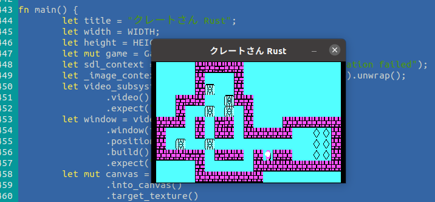

<div align="center">

# 👷 📦 クレートさん (CrateSan, or MrCrate)
[![Build Status][RustWorkflowBadge]][WorkflowUrl]
[![Build Status][VWorkflowBadge]][WorkflowUrl]

</div>

# CrateSan
A tribute to [Sokoban](https://sokoban.jp/) by Thinking Rabbit,
made in Rust and V languages, using SDL2 for multimedia.



# Try it
## With Rust
```
$ cargo run
```

## With V
```
$ v run src/cratesan.v
```

# Build prerequisites

## Rust
### Linux
You only need to install standard SDL2 dev packages (search for that elsewhere on the web).

### Windows
Follow [the rust-sdl2 instructions](https://github.com/Rust-SDL2/rust-sdl2).
At the end, you should have the folders "gnu-mingw" and "msvc" alongside this README.md,
in order to build on Windows.

# Controls
- Arrows to move the player
- "u" to undo last move
- "s" to save snapshot
- "l" to load snapshot
- "r" to restart level
- Return to proceed to next level, when current is won

# Credits
- All the levels are Copyright Thinking Rabbit, downloaded from this [URL](https://www.sourcecode.se/sokoban/levels?act=dnl_text&file=Original.slc).
- Artwork based on Sokoban PC version Copyright Spectrum Holobyte, taken from screenshots at this [URL](https://www.abandonware-france.org/ltf_abandon/ltf_jeu.php?id=468)

[RustWorkflowBadge]: https://github.com/nsauzede/cratesan_/workflows/Rust/badge.svg
[VWorkflowBadge]: https://github.com/nsauzede/cratesan_/workflows/V/badge.svg

[WorkflowUrl]: https://github.com/nsauzede/cratesan_/commits/main
